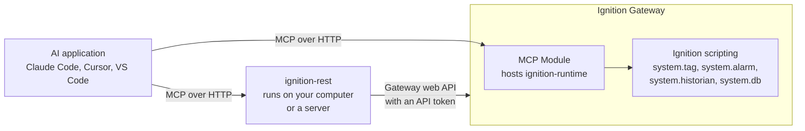

# How it works

> 中文版：[`how-it-works.zh-CN.md`](how-it-works.zh-CN.md)

This page explains what the two servers are, what happens when an AI agent calls a Tool, and how the
safety checks work. You do not need it to install anything, but it makes the setup steps and the
error messages easier to follow.

## What MCP is

MCP, the Model Context Protocol, is a standard way for an AI application to use outside Tools. The
AI application, such as Claude Code, Cursor or VS Code, is the **client**. A program
that offers Tools is an **MCP server**. The client asks the server for its Tool list, shows the Tools
to the AI model, and sends a request to the server when the model decides to use one.

This repository gives you two MCP servers for an Ignition Gateway. You connect your AI application
to one of them or to both.

## The two servers

| | `ignition-rest` | `ignition-runtime` |
| --- | --- | --- |
| Where it runs | As its own program, on any machine that can reach the Gateway | Inside the Gateway, hosted by the official Ignition MCP Module |
| How it talks to Ignition | Through the Gateway's web API, the "REST" API | Through Ignition's scripting functions |
| What it covers | Gateway information, configuration resources, projects, Perspective Views, audit logs, alarm pipelines, exports and imports | Tag values and Tag configuration, UDTs, alarm shelving, Historian, approved database queries |
| How you install it | Run `ignition-mcp setup`, then `ignition-mcp start` | Run `ignition-mcp setup`, which installs the MCP Module and deploys this repository's Tools |
| Setup guide | [Quick start](quick-start.md) | [Quick start](quick-start.md) |

The two servers never offer the same operation. If the Gateway's web API can do something fully,
the REST server owns it. Everything else belongs to the Runtime server. So to read a Tag value you
need the Runtime server, and to change a database connection you need the REST server.

### Which server do I need?

| I want the agent to... | Server |
| --- | --- |
| read live Tag values, browse Tags, read Tag history | Runtime |
| write Tag values, create or change Tags | Runtime |
| shelve or unshelve alarms | Runtime |
| run a database query I approved | Runtime |
| see the Gateway version, modules and health | REST |
| read or change Gateway configuration, such as database connections or Tag providers | REST |
| list, export or import projects | REST |
| read or edit Perspective Views | REST |
| read the Gateway audit log or alarm notification pipelines | REST |

`ignition-mcp setup` deploys both planes for the roles you choose. The Analysis role reads only; the
Engineer role also writes, in a `dev` deployment. Most deployments start with the Analysis role
alone, because reading Tags and history is the most common request.

## What happens when the agent calls a Tool

### A read

1. The agent sends the Tool name and its inputs.
2. The server checks the inputs, such as path length and the number of items. A bad input stops
   here with `invalid_argument`.
3. The server asks Ignition for the data.
4. The server checks the size of the answer. An answer that is too large fails with
   `limit_exceeded`. The server never cuts an answer short without saying so.
5. The agent gets structured data that matches the Tool's published JSON Schema.

### A write

A write passes every one of these checks, in this order, before anything changes. The first check
that fails decides the error.

| Check | REST server | Runtime server | Error if it fails |
| --- | --- | --- | --- |
| Is the Tool visible at all? | the class switch, such as `IGNITION_MCP_CONFIG_MUTATION_ENABLED` | the profile | the Tool is not in the list |
| Does the caller have the right? | the token's scope | the token's security level | `permission_denied` |
| Is this Tool allowed to write here? | `IGNITION_MCP_MUTATION_OPERATIONS` | the Runtime Target Policy exists and is valid | `operation_disabled` |
| Is the target a protected kind? | refused resource types, the `IgnitionMCPPolicy` provider | the `IgnitionMCPPolicy` provider | `permission_denied` |
| Is this exact target allowed? | `IGNITION_MCP_MUTATION_TARGETS` | the policy's `allowlists` | `permission_denied` |
| Is the agent's copy still current? | the `signature` or fingerprint matches | the fingerprint matches | `conflict` |

Then the server makes the change once, reads the target back, and reports what it saw. In a batch,
the server checks every item before it changes the first one. One bad item stops the whole batch.
After the checks, items run one by one, and a failure part-way does not undo earlier items.

If the server cannot tell whether a change happened, for example because the connection dropped,
it answers `outcome_unknown`. It never retries a write on its own. Read the target to see its real
state before you try again.

### Why the agent has to read before it changes something

Most change Tools take a token from an earlier read: a `signature` from `config_resource_get`, a
`tcf1:` fingerprint from `tag_get_config`, or a `pcf1:` fingerprint from a Perspective read. These are
called Precondition tokens. They prove the agent saw the current state. If someone else changed the
target in between, the token no longer matches, the call fails with `conflict`, and nothing
changes. The agent then reads again and decides again.

Tools that create something new, such as `tag_create`, take no token. They fail with `conflict` if the
target already exists, so they never overwrite anything.

## Errors

Every Tool error has a `code`, a `message` and a `correlationId`.

| Code | What it means | What to do |
| --- | --- | --- |
| `invalid_argument` | An input is wrong or too long. | Read the message and fix the input. |
| `permission_denied` | The caller or the target is not allowed. | Check the scope, the security level and the allowlist. |
| `operation_disabled` | The feature is switched off in this deployment. | Turn on the switch named in the [Tool catalog](tools.md). |
| `unsupported_capability` | The Gateway does not offer what this Tool needs. | Check the Gateway version and modules. |
| `not_found` | The target does not exist, or you may not see it. | Check the name or path. |
| `conflict` | The target changed since you read it, or already exists. | Read again, then retry with the new token. |
| `limit_exceeded` | The request or the answer is larger than allowed. | Ask for less, for example a shorter time range or fewer paths. |
| `rate_limited` | Too many requests. | Wait and retry. |
| `timeout` | Ignition did not answer in time. | Retry a read. For a write, read the target first. |
| `outcome_unknown` | A write may or may not have happened. | Read the target before doing anything else. |
| `gateway_unavailable` | The Gateway cannot be reached. | Check the Gateway and the network. |
| `upstream_error` | The Gateway returned an error. | Read the message. |
| `schema_mismatch` | The Gateway's answer has an unexpected shape. | Check that the Gateway version is one this project tested. |
| `internal_error` | A bug in the server. | Report it with the `correlationId`. |

On the REST server, pass the `correlationId` to `operation_diagnose` to see how far the call got. The
same id is in the server's log. The [runbook](../operations/runbook.md#reading-operation_diagnose-output)
explains the fields.

## Records and audit

The REST server keeps its own audit records and call records in `IGNITION_MCP_DATA_DIR`. Every write,
and every refused write, gets an audit record with the caller's name. Secrets never appear in logs,
audit records or Tool answers.

Runtime writes go into Ignition's own audit log, under the `serviceIdentity` named in the Runtime
Target Policy, when `auditMode` is `best_effort` or `required`.

## Two details for client developers

These only matter if you write code that reads the Runtime server's answers directly.

- The MCP Module does not publish each Tool's output schema. The schemas in `contracts/schemas/` are
  the reference.
- The MCP Module drops JSON `null` values inside objects. The Runtime server therefore writes a null
  as `{"$ignition":"null"}`. An object that itself contains the key `$ignition` is written as
  `{"$ignition":"object","entries":[[key, value], ...]}`. Decode these once to get the original
  data. The REST server does not do this.

## Tested versions

| Ignition Gateway | MCP Module | Live test gate | Module response format |
| --- | --- | --- | --- |
| 8.3.8 (build `b2026071409`) | `1.3.5.2026021307-SNAPSHOT` | `VERIFIED` | `VERIFIED_WITH_LIMITATION`: works, without published output schemas |
| 8.3.9 (build `b2026082511`) | same | `VERIFIED` | `FAILED_NATIVE_BINDING`: not confirmed on this version |

`VERIFIED` means the automated tests deployed everything and called the Tools on a real Gateway of
that version. The project does not call any version production-supported. Other versions may work,
and `ignition-mcp status` reports the Gateway version and the Module build it reads without judging
compatibility, so an untested tuple stays unjudged. The evidence files are in
`tests/compatibility/evidence/`.

## Words used in these docs

Agent
: The AI model that calls the Tools, through an AI application.

Gateway
: The Ignition server. It has a web interface, usually on port 8088.

API token
: A key you create on the Gateway so a program can use its web API. Ignition calls it an
  `api-token` resource. Its security levels decide what it may do.

Scope
: A permission on a REST server caller's token: `ignition.read`, `ignition.config`,
  `ignition.control` or `ignition.admin`.

Profile
: For the Runtime server, the named set of Tools an endpoint offers: `readonly`, `operator`,
  `configurator` or `full`. `ignition-mcp setup` gives the Analysis role `readonly` and the Engineer
  role `full`. For the REST server, `IGNITION_MCP_DEPLOYMENT_PROFILE` is a different setting that
  controls how strict the server is.

Server Config
: The MCP Module's record of one Runtime endpoint: its name, its Tool list and who may connect.

Bundle
: This repository's Runtime Tools, packed as an Ignition project ZIP.

Runtime Target Policy
: A JSON document on the Gateway that lists what each Runtime write Tool may change.

Allowlist
: A list of the targets a write Tool may change. Anything not on the list is refused.

Target
: The thing a write changes: a Tag path, an alarm path, a project, or a configuration resource.

Precondition token
: A value from an earlier read that a change must present, to prove the agent saw the current
  state.

Artifact
: A file the REST server stores for you, such as a project export.

Mutation
: Any Tool call that changes something. The docs also call it a write.
