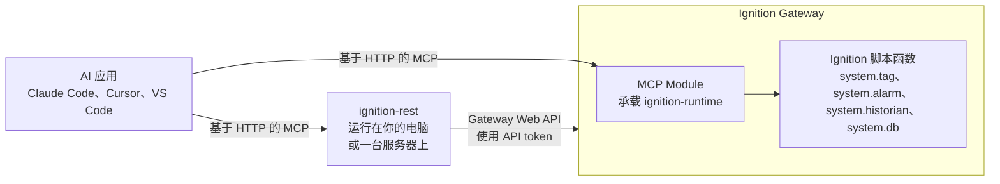

# 运作原理

> English: [`how-it-works.md`](how-it-works.md)。本文是英文版的译本，两者不一致时以英文版为准。

本文说明两个 server 是什么、AI agent 调用一个 Tool 时发生了什么，以及安全检查如何工作。安装时不必读它，但读过之后，安装步骤和错误信息会更好理解。

## MCP 是什么

MCP 全称 Model Context Protocol，是 AI 应用使用外部工具的标准方式。AI 应用，例如 Claude Code、Cursor 或 VS Code，叫做**客户端**。提供 Tool 的程序叫做 **MCP server**。客户端向 server 要来 Tool 列表，交给 AI 模型；模型决定用某个 Tool 时，客户端就向 server 发送请求。

本仓库为 Ignition Gateway 提供两个 MCP server。你可以让 AI 应用连接其中一个，或者两个都连。

## 两个 server

| | `ignition-rest` | `ignition-runtime` |
| --- | --- | --- |
| 运行位置 | 作为独立程序，运行在任何能连到 Gateway 的机器上 | 运行在 Gateway 内部，由官方 Ignition MCP Module 承载 |
| 和 Ignition 通信的方式 | 通过 Gateway 的 Web API，也就是 REST API | 通过 Ignition 的脚本函数 |
| 负责的内容 | Gateway 信息、配置资源、项目、Perspective View、审计日志、报警通知管道、导出和导入 | Tag 值和 Tag 配置、UDT、报警搁置、Historian、已批准的数据库查询 |
| 安装方式 | 运行 `ignition-rest-mcp` | 运行 `ignition-mcp setup` 安装 MCP Module 并部署本仓库的 Tool |
| 安装指南 | [快速开始](quick-start.zh-CN.md) | [快速开始](quick-start.zh-CN.md) |

两个 server 从不提供同一个操作。只要 Gateway 的 Web API 能完整完成某件事，这件事就归 REST server；其余的都归 Runtime server。所以读 Tag 值要用 Runtime server，改数据库连接要用 REST server。

### 我需要哪个 server

| 我想让 agent…… | Server |
| --- | --- |
| 读取实时 Tag 值、浏览 Tag、读取 Tag 历史 | Runtime |
| 写入 Tag 值，新建或修改 Tag | Runtime |
| 搁置或取消搁置报警 | Runtime |
| 运行我批准过的数据库查询 | Runtime |
| 查看 Gateway 版本、模块和健康状态 | REST |
| 读取或修改 Gateway 配置，例如数据库连接或 Tag provider | REST |
| 列出、导出或导入项目 | REST |
| 读取或编辑 Perspective View | REST |
| 读取 Gateway 审计日志或报警通知管道 | REST |

两个 server 都可以单独安装。很多人先装 Runtime server 并使用 `readonly` 模式，因为读 Tag 和历史数据是最常见的需求。

## agent 调用 Tool 时发生了什么

### 读取

1. agent 发送 Tool 名和输入。
2. server 检查输入，例如路径长度和条目数量。输入不合法时在这里停下，返回 `invalid_argument`。
3. server 向 Ignition 请求数据。
4. server 检查回答的大小。回答太大时返回 `limit_exceeded`。server 从不在不告诉你的情况下截断回答。
5. agent 收到结构化数据，数据符合该 Tool 发布的 JSON Schema。

### 写入

写入要按顺序通过下面每一项检查，才会真正改动任何东西。第一个没通过的检查决定返回哪个错误。

| 检查 | REST server | Runtime server | 没通过时 |
| --- | --- | --- | --- |
| 这个 Tool 是否可见？ | 类别开关，例如 `IGNITION_MCP_CONFIG_MUTATION_ENABLED` | profile | Tool 不出现在列表里 |
| 调用方有没有这个权限？ | token 的 scope | token 的安全级别 | `permission_denied` |
| 这个 Tool 在此部署中能不能写？ | `IGNITION_MCP_MUTATION_OPERATIONS` | Runtime Target Policy 存在且有效 | `operation_disabled` |
| 目标是不是受保护的类型？ | 被拒绝的资源类型、`IgnitionMCPPolicy` provider | `IgnitionMCPPolicy` provider | `permission_denied` |
| 这个具体目标是否被允许？ | `IGNITION_MCP_MUTATION_TARGETS` | policy 的 `allowlists` | `permission_denied` |
| agent 看到的状态还是最新的吗？ | `signature` 或 fingerprint 一致 | fingerprint 一致 | `conflict` |

通过之后，server 只执行一次修改，再读回目标，报告它看到的结果。批量操作时，server 会先检查所有条目，再改第一条；任何一条不合格，整批都不执行。检查通过后，条目逐条执行；中途失败不会撤销前面已完成的条目。

如果 server 无法判断修改是否生效，例如连接中断，它会返回 `outcome_unknown`。它从不自动重试写入。请先读取目标的真实状态，再决定要不要重试。

### 为什么 agent 必须先读再改

大多数修改 Tool 需要一个来自先前读取的 token：`config_resource_get` 返回的 `signature`、`tag_get_config` 返回的 `tcf1:` fingerprint，或 Perspective 读取返回的 `pcf1:` fingerprint。这类 token 叫做 Precondition token，用来证明 agent 看到的是当前状态。如果这期间有人改了目标，token 就对不上，调用以 `conflict` 失败，什么都不改。agent 需要重新读取，再重新决定。

新建类的 Tool，例如 `tag_create`，不需要 token。目标已经存在时它们返回 `conflict`，所以永远不会覆盖任何东西。

## 错误

每个 Tool 错误都带有 `code`、`message` 和 `correlationId`。

| 错误码 | 含义 | 怎么办 |
| --- | --- | --- |
| `invalid_argument` | 输入有误或太长。 | 看 message，修正输入。 |
| `permission_denied` | 调用方或目标不被允许。 | 检查 scope、安全级别和 allowlist。 |
| `operation_disabled` | 此功能在该部署中被关闭。 | 打开 [Tool 目录](tools.zh-CN.md)里写明的开关。 |
| `unsupported_capability` | Gateway 不提供这个 Tool 需要的功能。 | 检查 Gateway 版本和模块。 |
| `not_found` | 目标不存在，或你无权看到。 | 检查名称或路径。 |
| `conflict` | 目标在你读取后被改过，或者已经存在。 | 重新读取，再用新 token 重试。 |
| `limit_exceeded` | 请求或回答超过上限。 | 少要一些，例如缩短时间范围或减少路径数。 |
| `rate_limited` | 请求太频繁。 | 等一会儿再试。 |
| `timeout` | Ignition 没有及时回答。 | 读取可以重试。写入要先读取目标。 |
| `outcome_unknown` | 写入可能生效了，也可能没有。 | 先读取目标，再做任何事。 |
| `gateway_unavailable` | 连不上 Gateway。 | 检查 Gateway 和网络。 |
| `upstream_error` | Gateway 返回了错误。 | 看 message。 |
| `schema_mismatch` | Gateway 回答的结构不符合预期。 | 确认 Gateway 版本是本项目测试过的版本。 |
| `internal_error` | server 的 bug。 | 带上 `correlationId` 报告问题。 |

在 REST server 上，把 `correlationId` 交给 `operation_diagnose`，就能看到这次调用进行到了哪一步。server 日志里也有同一个 id。各字段的含义见[运维手册](../operations/runbook.zh-CN.md#阅读-operation_diagnose-的输出)。

## 记录和审计

REST server 把自己的审计记录和调用记录保存在 `IGNITION_MCP_DATA_DIR` 里。每一次写入，包括被拒绝的写入，都会留下一条带调用方名称的审计记录。机密信息从不出现在日志、审计记录或 Tool 回答里。

`auditMode` 为 `best_effort` 或 `required` 时，Runtime 的写入会记入 Ignition 自己的审计日志，执行者名称是 Runtime Target Policy 里的 `serviceIdentity`。

## 给客户端开发者的两个细节

只有当你自己写代码直接解析 Runtime server 的回答时，才需要关心这两点。

- MCP Module 不发布每个 Tool 的输出 schema。以 `contracts/schemas/` 里的 schema 为准。
- MCP Module 会丢掉对象里的 JSON `null` 值，所以 Runtime server 把 null 写成 `{"$ignition":"null"}`。本身含有 `$ignition` 键的对象写成 `{"$ignition":"object","entries":[[key, value], ...]}`。解码一次即可还原原始数据。REST server 不做这种编码。

## 已测试的版本

| Ignition Gateway | MCP Module | 实机测试关卡 | Module 回应格式 |
| --- | --- | --- | --- |
| 8.3.8，build `b2026071409` | `1.3.5.2026021307-SNAPSHOT` | `VERIFIED` | `VERIFIED_WITH_LIMITATION`：可用，但没有发布输出 schema |
| 8.3.9，build `b2026082511` | 同上 | `VERIFIED` | `FAILED_NATIVE_BINDING`：在这个版本上未确认 |

`VERIFIED` 表示自动化测试在对应版本的真实 Gateway 上完成了部署并调用了 Tool。本项目不把任何版本称为获得生产支持。其他版本也许能用，`ignition-mcp status` 会报告 Gateway、Module build 和 bundle 的实际状态。证据文件在 `tests/compatibility/evidence/`。

## 本文用到的词

Agent
: 通过 AI 应用调用 Tool 的 AI 模型。

Gateway
: Ignition 服务器。它有网页界面，通常在 8088 端口。

API token
: 你在 Gateway 上创建的密钥，让程序可以使用 Gateway 的 Web API。Ignition 里叫 `api-token` 资源。它能做什么由它的安全级别决定。

Scope
: REST server 调用方 token 上的权限：`ignition.read`、`ignition.config`、`ignition.control` 或 `ignition.admin`。

Profile
: 在 Runtime server 中，指一个 endpoint 提供的一组具名 Tool：`readonly`、`operator`、`configurator` 或 `full`。在 REST server 中，`IGNITION_MCP_DEPLOYMENT_PROFILE` 是另一个设置，决定 server 有多严格。

Server Config
: MCP Module 对一个 Runtime endpoint 的记录，包括名称、Tool 列表和允许谁连接。

Bundle
: 本仓库的 Runtime Tool，打包成一个 Ignition 项目 ZIP。

Runtime Target Policy
: 存在 Gateway 上的一份 JSON 文档，列出每个 Runtime 写入 Tool 可以改什么。

Allowlist
: 写入 Tool 可以修改的目标列表。不在列表里的一律拒绝。

Target
: 一次写入要修改的对象：Tag 路径、报警路径、项目或配置资源。

Precondition token
: 修改时必须出示的、来自先前读取的值，用来证明 agent 看到的是当前状态。

Artifact
: REST server 替你保存的文件，例如项目导出。

Mutation
: 任何会改动东西的 Tool 调用。文档里也叫写入。
